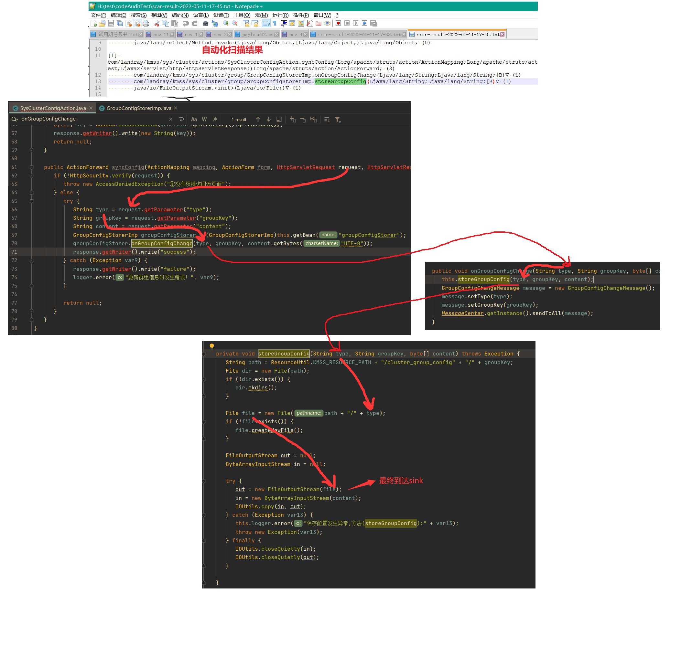

## 一些讲解
......

## GadgetInspector
我仅仅修改了原版GI的代码结构（利于我阅读以及理解），添加了一些source和sink配置；

原版GI仓库地址： `https://github.com/JackOfMostTrades/gadgetinspector` 

具体说明如下：

- 添加了常见的source，例如SpringMVC、Servlet、Struts；
- 添加了常见sink，目前已添加了80个常见sink；
- 添加了method Annotation信息，帮助更精确的找到source或者sink；
- 注意，仍旧存在污点传播能力边界，例如PUTFIELD、NEWARRAY等指令，GI的处理粒度太大，没处理这部分，导致污点传播断开；所以为了不漏报，最好扫两次，分别使用污点传播和非污点传播扫；

## 使用方法

例如使用如下命令进行扫描兰陵EKP：

```bash
java -jar GadgetInspector-1.0-SNAPSHOT.jar --is-springboot false --package com.landray --class-path /Volumes/Seagate/classes --jar-path /Volumes/Seagate/code_audit/jar --type struts  --use-taint true
```

```
> target file: 
> package name: com.landray
> class path: /Volumes/Seagate/classes
> jar path: /Volumes/Seagate/code_audit/jar
> scan type: struts
> use taint track analyze
> selected sinks : ALL
```

例如扫出来的一个结果，从代码上来看，确实是可确认的漏洞：



## 常用参数案例

（1）例如扫描某个springboot应用，并且启用污点分析，则使用如下命令：

```
java -jar GadgetInspector-1.0-SNAPSHOT.jar --is-springboot true --package org.sec.sidemo --target-file SIDemo-0.1.jar  --type springMVC --use-taint true
```

（2）例如扫描自定义位置的class和依赖jar包，并且启用污点分析，则使用如下命令：

```
java -jar GadgetInspector-1.0-SNAPSHOT.jar --is-springboot false --package com.landray --class-path H:\code_audit\classes --jar-path H:\code_audit\jar --type struts  --use-taint true
```

## 漏洞覆盖能力测试

使用如下命令测试 `java-sec-code` 项目（github: https://github.com/JoyChou93/java-sec-code）:

```
java -jar GadgetInspector-1.0-SNAPSHOT.jar --is-springboot true --package org.joychou --target-file java-sec-code-1.0.0.jar --type springMVC --use-taint true
```

扫描结果： [scan-result-2022-05-21-01-51.txt](media/scan-result-2022-05-21-01-51.txt) 

除了个别涉及到 `Integer` 等数据类型的污点无法传播外，在使用污点分析的前提下，都扫描出来了；


## 自定义sink说明

- 参照 `common-sinks.txt` 进行自定义即可；
- 如果想忽略sink的某一项(例如忽略形参列表)，直接填 `null` 即可；
- 如果想忽略 `taintArg` ，则直接填 -1 即可；
- `matchSubClassMethod` 代表是否匹配这个sink点的子类重写的方法；
- 一定要注意，如果sink点是一个静态调用，那么 `taintArg` 是从0开始的，非静态调用其实也是从0开始，只不过非静态调用 `taintArg=0` 代表对象本身是污点；

## 自定义source说明

可以直接参考 `fun.pinger.source.servlet` 的编写，根据不同审计项目场景，自行编写source；

## 一些提示
- 例如 `request.getParameter("a")` 这种方法调用，为了保证准确性，可以手动设置 `javax.servlet.ServletRequest#getParameter` 方法的污染参数为0；
- 手动设置 `passthrough` 在 `methodVisitor.visitor.fun.pinger.TaintTrackingMethodVisitor.PASSTHROUGH_DATAFLOW` 位置；
- 因为只有寻找反序列化利用链才需要考虑 `transient` ，所以对于非反序列化 source ，我都进行了非 `transient` 判断；
- 在 `PASSTHROUGH_DATAFLOW` 自定义 passthrough 时，要注意这种情况，比如 `HttpServletRequest` 继承于 `SerlvetRequest` ， `HttpServeltRequest#getParameter()` 方法是继承于 `ServletRequest` 类的，但是如果直接调用的是 `HttpServeltRequest#getParameter()` ，那么定义的 passthrough 就是 `{ "javax/servlet/http/HttpServletRequest", "getParameter", "(Ljava/lang/String;)Ljava/lang/String;", 0 }` ；

## 目前的局限性
- 因为是使用ASM模拟JVM栈帧，所以只能扫已编译好的项目（其实也是它的优势）；
- 对于没有将返回值赋值给变量的 methodCall ，是不支持污点传播的，例如 `StringBuilder content = new StringBuilder(); content.append(new String(b, 0, lens)); Runtime.getRuntime().exec(content.toString())` 这种情况污点传播会断开，因为 `content.append()` 方法没有把返回值赋值给新的变量（当然，就算赋值，也只能沿着新变量传播污点）；
